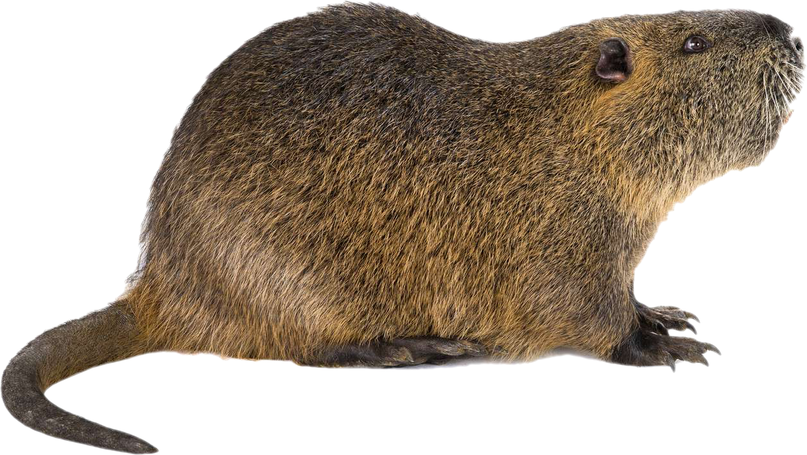

# Predicting future damage costs of non-native species

Paper:  
 
Ahmed, DA, CJA Bradshaw, N Tahat, EJ Hudgins, P Courtois, PE Hulme, Y Watari, AS Tarkan I Soto, PJ Haubrock, P Balzani, RN Cuthbert. Predicting future damage costs of non-native species using combined 3 dynamical and cost-density equations. In review
